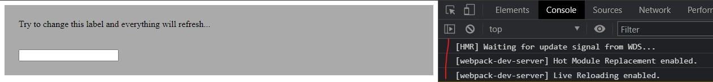

# webpackDevServer4HMR
Problem with *webpack 5* and *webpack-dev-server 4* basic hot reloading: the entire page is refreshed!

## Issues

- When I try to change a thing (also a simple word), then the entire page refresh, even if on startup developer tools console shows:

-----

- **Operating System:** _Windows 10 Pro 20H2 - x64_
- **Node Version:** _v14.17.0_
- **NPM Version:** _6.14.13_
- **webpack Version:** _5.37.1_
- **webpack-dev-server Version:** _4.0.0-beta.3_
- **webpack-cli** _4.7.0_
- **@pmmmwh/react-refresh-webpack-plugin** _0.5.0-beta.8_
- **Browser:** _Google Chrome Version 90_

- [x] This is a **bug**

### Code

Repository link: https://github.com/FlavioMH/webpackDevServer4HRM

Repository has been created starting from a bigger project, so you can find out some webpack settings or package.json entries not used in this sample. What it is important to know is that the project actually (tries to) work on:
- react
- redux
- typescript

### Expected Behavior

Before to update to webpack v5, I was using webpack v4 with webpack-dev-server v3.11.2. I was also using react-hot-loader and expected behavior was:
- listing on Visual Studio Code console files affected by reload
- listing on developer tools console files affected by reload
- browser not to refresh whole page, but only changed label

### Actual Behavior

Once I save the file, never mind about what change I am doing, browser immediately shows tabl loading spinner and the enite page is refreshed.
This happens even if HRM seems to be activated.

### How can we reproduce the behavior?

1. Clone the repository [FlavioMH/webpackDevServer4HRM](https://github.com/FlavioMH/webpackDevServer4HRM)
2. `npm install`
3. `npm run app`
4. Try to change "Try to change this label and everything will refresh..." sentence into `testApplication.tsx` file 
